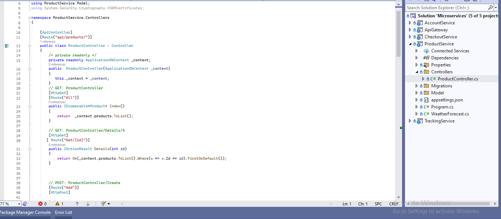
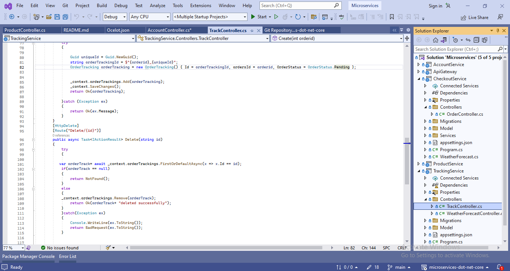

# microservices-dot-net-core

Building a Scalable eCommerce Platform with Microservices using .NET Core

## Introduction

In the fast-paced world of online business, creating an eCommerce platform that can grow seamlessly and withstand challenges is crucial. Companies must prioritize the development of a digital storefront that can handle increased demand and bounce back from any disruptions in the market.This Comprehensive Guide dive deep into a cutting eCommerce Solution Using Microservice

## Technology Used

**Backend:** Asp.Net Core ,C#

**DataBase:** SQL Server

## Getting Started

- In order to run the project a small amount of prerequisites and additional steps have to be fulfilled.

### Prerequisites

- Visual Studio IDE installed

### Running

- Clone the Project from Github Repository

- Open `Microservice.sln` file using Visual Studio IDE

### Starting

- Right Click on `Solution Microservice` File and Go to Properties.

- Select `Multiple Startup Projects` Option and Select Action `Start` for All the Projects.

- Now Click on `Apply` and start the Project

## Roadmap

- Creating A New Project of Asp.net Core

- Creating Microservice In Asp.net Core

- Adding Database Connection

- Creating API Gateway Using Ocelot

# Screenshots

### Api Gateway

### Product Service

### Account Service

### Checkout Service

### Tracking Service

### Project Starting

# Contents

## Product Service

- Description and responsibilities.
- Table schema for storing product information.

## Account Service

- Description and responsibilities
- Table Schema for storing User information

## Checkout Service

- Description and responsibilities
- Table Schema for storing Order and OrderItem information

## Tracking Service

- Description and responsibilities
- Table Schema for Storing OrderTrack information

## ApiGateway

- Routes To All the Service Using Ocelot

### Setting Up the enviourment

- .Net Core and any other Required Tools

### Model Classes

- Product Class

- User Class
  

- OrderClass
  

- OrderTrack Class
  

- OrderStatus Class
  
